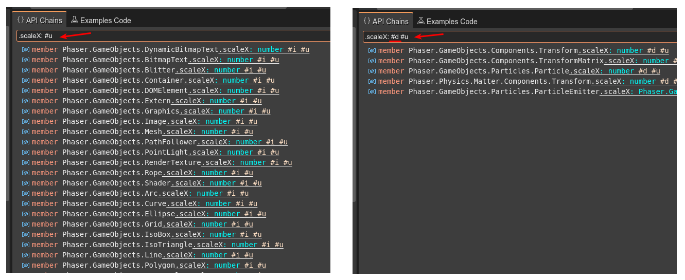

# Unofficial Phaser Help Center

The [Unofficial Phaser Help](https://helpcenter.phasereditor2d.com) is an integrated, desktop-like tool for browsing the [Phaser.io](https://phaser.io) documentation and examples. Phaser is a popular HTML5 game framework.

This is not an official Phaser product. It is developed and maintained by the [Phaser Editor 2D team](https://phasereditor2d.com).

## Launching

This tool is online at [helpcenter.phasereditor2d.com](https://phasereditor2d.com). It requires a modern, updated browser. 

It uses Progressive Web Application (PWA) techniques, so you can install it in your OS and open it offline.

Our recommendation is using Google Chrome. This browser provides the best PWA support for the desktop.

Also, you can download this repository and launch it locally. Just copy the content of the `source/` folder in a directory served by Apache or any other PHP-compatible web server.

If you have PHP installed in your system, you can run:

```
php -S localhost:9090 -t source
```

## Overview

This tool provides different views of the Phaser documentation and examples.

The **API**, **Phaser Files**, and **API Chains** views, show the Phaser documentation content but with different layouts and syntax.

The **Examples** and **Examples Code** views show the content of the Phaser examples.

The **Inspector** shows the information related to the element selected in the active view or editor. For example, if you select an example in the **Examples** view, the **Inspector** view shows the example's code and a screenshot image.

The **editor area** allows opening certain content in a tab. So you can open many tabs and close them. You can open here things like the documentation or source code of an API element, the source code of an example, or a group of examples.

## API view

The API view shows the Phaser API with a hierarchical layout.

You can open an API element in a Documentation editor by double-clicking on it. Also, with the context menu you can select opening an element's source code in an editor.

When you select an element, the **Inspector** view shows the its documentation.


### Layout

By default, it shows a **Flat** layout. It shows a list of all the namespaces. Only classes and types are shown in a second level. You can change it to a **Tree** layout using the context menu:


## Inherited members

By default, it shows all the members of a class, including inherited members. If you want to hide the inherited members, open the context menu and unselect the **Show Inherited Members** option.

Inherited members are shown with a gray color:


### Category filter

You can filter the content by category.

The **Type** category contains all classes and types.

The **Constant** category contains all constants.

The **Event** category shows all events.

You can select only one category at the same time. To clear the "category filter", click again on the selected category:


### Text filter

You can perform text queries for matching the signature of the elements:


## Phaser Files

The **Phaser Files** shows all the Phaser source files. It follows the same structure of the Phaser repository, but under each file, it shows the API elements defined in it.

This view helps you on finding the relation between the Phaser API and the source files structure.

In Phaser it is common to find API elements belonging to the same namespace, but are defined in separate files. It is the case of the `Phaser.Loader.LoaderPlugin.spritesheet()` method. In the **API** view it is shown in the `Phaser.Loader.LoaderPlugin` class. However, like many other "loader methods", it is defined in its own file, the `SpriteSheetFile.js`, in the `src/loader/filetypes/` folder.

This view helps you understand how the Phaser 3 code is structured.


### Phaser Files view's context menu

The context menu shows the options to open the selected API element in a documentation editor, a source editor, or reveal it in the **API** view.

## API Chains view

If you follow the Phaser community since the Phaser 2 days, maybe you remember the [Phaser Chains](https://chains-phaser2.phasereditor2d.com/) tool we did for Phaser 2. It also was included in the Phaser Editor v1 and Phaser Editor v2.

It had certain popularity, because its particular way for browsing the Phaser API.

Now, we include it the Unofficial Phaser Help Center.

### API chains

The particularity of this view is that it shows all the elements of the Phaser API in a list. It renders the member with its full name and signature. But also, and this is the key point, it shows chains elements.

In Phaser games, you can write lot of code that with a chain of property/method class. For example, you load the assets this way:

```
this.load.spritesheet(...)
this.load.atlas(...)
```

You chain the scene's `load` property with the `spritesheet()` method.

You follow the same style for adding new objects to the scene:

```
this.add.sprite(...)
this.add.text(...)
```

You chain the scene's `add` property with the `sprite()` method.

The **API Chains** takes advantage of this syntax and shows these chains. This means, you can search for idiomatic constructions like `this.add.sprite` and it will show all chains matching it:


### Query syntax

You can use different "tricks" for making more accurate filters.

To allow writing idiomatic code and matching the right chains, the `this` word at the beginning of the query matches with the `Phaser.Scene` text. We call it expansion. You write `this pause(` and it expands to `Phaser.Scene pause(`. The expanded form, or pattern, is the one used for the search.

The query does not allow special symbols or wildcards. Each word is separated by a space and the matching chains should contain all the words in the same order.

### Chains syntax

A chain syntax is very similar to the JavaScript syntax. It shows the full name of an API element with its signature and kind (member, function, class, etc...).

At the end of a chain, there are especial "tags". These tags help narrow the resulting chains. These are the current supported tags and what it means:

* `#i`: the API member is inherited.
* `#d`: the API member is declared (not inherited).
* `#c`: the row is a chain of property/method calls.
* `#u`: the row is just a member (un-chained).

For example, if you want to know all the classes with a `scaleX` property, you query for `.scaleX: #u`. Those are a lot. So you want to know only the classes where a `scaleX` property is declared. Then you query for `.scaleX: #d #u`:



### Chains context menu

Like the other API related views, the context menu shows the options for opening the selected element in the documentation editor or the source editor. Or reveal it in the **API** view.

## Examples view

The **Examples** view shows all the content in a hierarchy of categories (or folders). It follows the same structure of the [Phaser official examples](https://phaser.io/examples), but shown as a tree.

This allows performing quick queries on the examples, by the example's name or the category's name.

Each example shows a small screenshot image of the example.


A main function of this view is that you can select an example and run it. When you double-click an example, it opens the **Example Player** and runs it. Check the next section.

The context menu provides other option, like open the example in the source editor or the examples folder editor. 

## Example Player

The **Example Player** is a dialog that runs an example. You can open it by double-clicking in an example item of the **Examples** view. Or by selecting the **Play** option in the context menu in other parts.


The dialog contains buttons with different functions:

* **Open In Phaser Labs**: it opens the example in a new tab of the browser. The examples are hosted in the official Phaser Labs website. Later we explain how to change it and host them locally.
* **Open In Sandbox**: it opens the example in the Sandbox of the Phaser Labs website. This sandbox allows you changing the code of the example and run it with the modifications. It is an amazing resource for learning the Phaser.
* **View Source**: it opens the example's code in the source editor of the Help Center.
* **Refresh**: it reloads the example.
* **Close**: it closes the dialog.

As we mentioned before, the examples are hosted in the Phaser Labs website (http://labs.phaser.io). However, if your internet connection is slow, or you are not connected at all, you can download the Phaser examples and run them locally.

These are the steps:

* Download the Phaser examples from the repository: https://github.com/photonstorm/phaser3-examples

* Follow the instructions in the README file to run the examples locally. By default, it runs in the `http://127.0.0.1:8080` address.

* Open the Help Center Settings (main menu, right corner, the Settings option), and enter the new address for the Phaser Labs:

    


## Examples Code view

TODO

## Documentation editor

TODO

## Examples Folder editor

TODO

## Code editor

TODO

## License

MIT License.

This tool is free. All the code is available for you. You can modify it, run it in your local device or in your public website. Credits are not required but appreciated.


