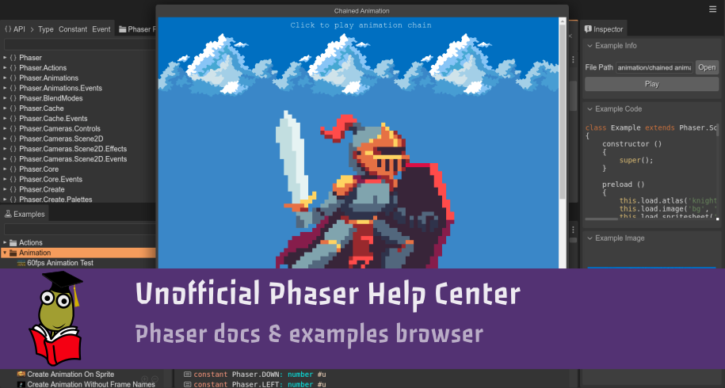

# Unofficial Phaser Help Center

The [Unofficial Phaser Help](https://helpcenter.phasereditor2d.com) is an integrated, desktop-like tool for browsing the [Phaser.io](https://phaser.io) documentation and examples. Phaser is a popular HTML5 game framework.

This is not an official Phaser product. It is developed and maintained by the [Phaser Editor 2D team](https://phasereditor2d.com).

## Launching

This tool is online at [helpcenter.phasereditor2d.com](https://phasereditor2d.com). It requires a modern, updated browser. 

It uses Progressive Web Application (PWA) techniques, so you can install it in your OS and open it offline.

Our recommendation is using Google Chrome. This browser provides the best PWA support for the desktop.

Also, you can download this repository and launch it locally. Just copy the content of the `source/` folder in a directory served by Apache or any other PHP-compatible web server.

If you have PHP installed in your system, you can run:

```
php -S localhost:9090 -t source
```

## Overview

This tool provides different views of the Phaser documentation and examples.

The **API**, **Phaser Files**, and **API Chains** views, show the Phaser documentation content but with different layouts and syntax.

The **Examples** and **Examples Code** views show the content of the Phaser examples.

The **Inspector** shows the information related to the element selected in the active view or editor. For example, if you select an example in the **Examples** view, the **Inspector** view shows the example's code and a screenshot image.

The **editor area** allows opening certain content in a tab. So you can open many tabs and close them. You can open here things like the documentation or source code of an API element, the source code of an example, or a group of examples.

## API view

The API view shows the Phaser API with a hierarchical layout. 

### Layout

By default, it shows a **Flat** layout. It shows a list of all the namespaces. Only classes and types are shown in a second level. You can change it to a **Tree** layout using the context menu:


## Inherited members

By default, it shows all the members of a class, including inherited members. If you want to hide the inherited members, open the context menu and unselect the **Show Inherited Members** option.

Inherited members are shown with a gray color:


## Category filter

You can filter the content by category.

The **Type** category contains all classes and types.

The **Constant** category contains all constants.

The **Event** category shows all events.

You can select only one category at the same time. To clear the "category filter", click again on the selected category:


## Text filter

You can perform text queries for matching the signature of the elements:


## License

MIT License.

This tool is free. All the code is available for you. You can modify it, run it in your local device or in your public website. Credits are not required but appreciated.


